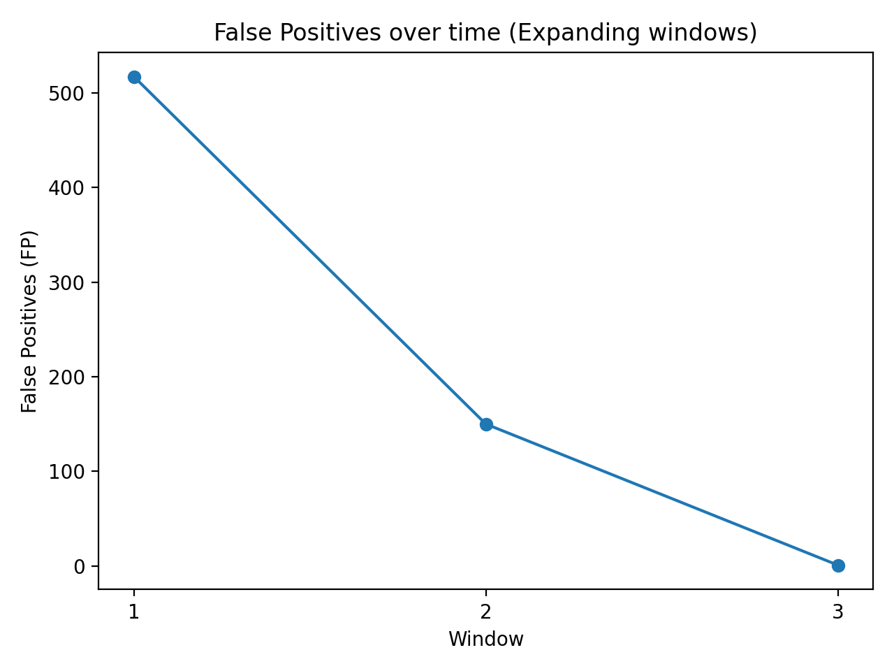
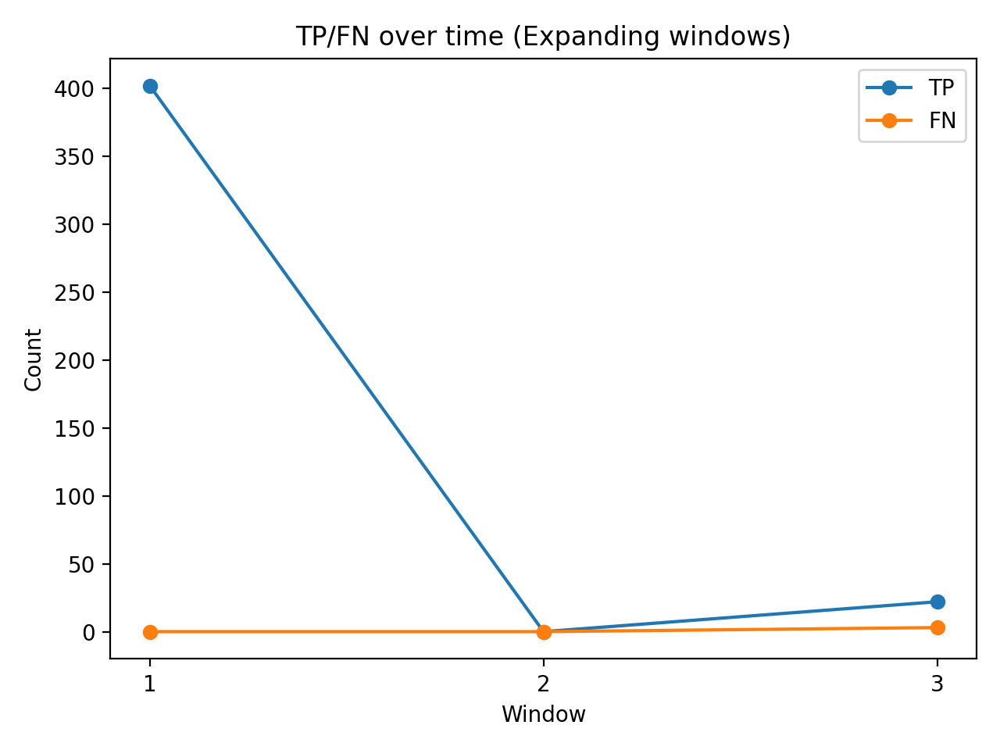

# Email Spam Detection (SpamAssassin)

A simple end-to-end email spam detection project using the SpamAssassin public dataset.
Baseline model: TF-IDF + Logistic Regression (scikit-learn).
Includes a Streamlit app for quick testing (text input → prediction + confidence).

## Project Structure
- notebooks/ : Jupyter notebooks (training + evaluation)
- data/raw/ : raw dataset (ignored via .gitignore)
- models/ : saved pipeline + threshold
- streamlit_app/ : Streamlit app (app.py)
- .github/workflows/ : CI workflow (GitHub Actions)

## Local Setup

    git clone https://github.com/GaneshPokharel-tech/email-spam-detection.git
    cd email-spam-detection
    python3 -m venv venv
    source venv/bin/activate
    pip install -r requirements.txt

## Download Dataset (SpamAssassin)

    cd data/raw
    curl -L -o spam_2.tar.bz2 https://spamassassin.apache.org/old/publiccorpus/20030228_spam_2.tar.bz2
    curl -L -o easy_ham.tar.bz2 https://spamassassin.apache.org/old/publiccorpus/20030228_easy_ham.tar.bz2
    tar -xjf spam_2.tar.bz2
    tar -xjf easy_ham.tar.bz2

Expected folders:
- data/raw/spam_2/
- data/raw/easy_ham/

## Train + Evaluate (Notebook)

    jupyter notebook

Run: notebooks/01_data_load_and_split.ipynb

## Run Streamlit App

    streamlit run streamlit_app/app.py

## Threshold tuning
Edit: models/threshold.txt

Example:

    echo 0.60 > models/threshold.txt

## CI
GitHub Actions runs basic checks on push/PR.

## Time-based (TREC-style) Evaluation (Research Extension)

Instead of random train/val/test split, I also evaluated the model using **chronological (time-based) splits** to simulate real-world deployment (train on past emails, test on future emails).  
This helps reveal **distribution shift / concept drift** over time and avoids leakage that can happen with random splits.

### Expanding-window results (3 windows)
- Window 1 (2002-07-23 → 2002-09-04): many false positives (FP=517) when using threshold=0.5  
- Window 2 (2002-09-04 → 2002-09-26): **0 spam in test**, so spam precision/recall/F1 are not meaningful; FP count is the key metric (FP=150)  
- Window 3 (2002-09-26 → 2003-07-20): strong performance (TN=934, FP=1, FN=3, TP=22)

**Key takeaway:** performance can change significantly by time period, so time-based evaluation is important for realistic spam detection.

### Expanding-window confusion matrices (threshold = 0.5)

| Window | Test range (UTC) | TN | FP | FN | TP |
|---|---|---:|---:|---:|---:|
| 1 | 2002-07-23 → 2002-09-04 | 42 | 517 | 0 | 402 |
| 2 | 2002-09-04 → 2002-09-26 | 811 | 150 | 0 | 0 |
| 3 | 2002-09-26 → 2003-07-20 | 934 | 1 | 3 | 22 |

### Time-based plots

**False Positives over time**

**TP vs FN over time**

## Time-based evaluation (script)

Run expanding-window (3 windows) time-based evaluation:

    python src/time_eval.py

